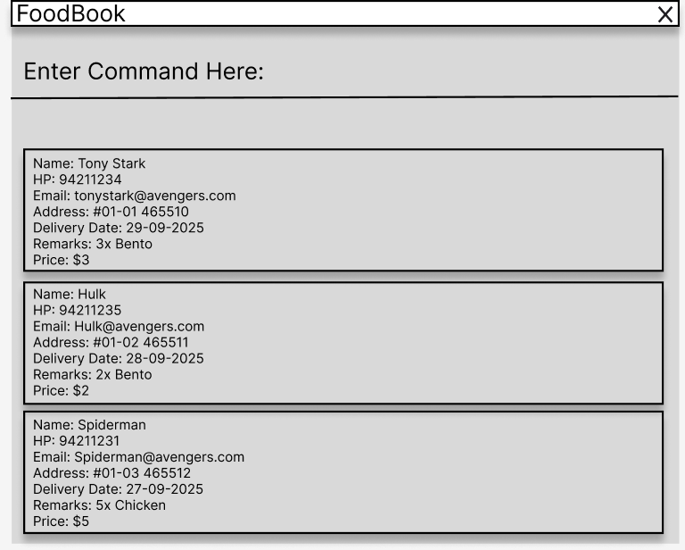

[](https://github.com/AY2526S1-CS2103T-F14a-1/tp/actions/workflows/gradle.yml)
[](https://codecov.io/gh/AY2526S1-CS2103T-F14a-1/tp)

# FoodBook

[![Build Status]
(https://github.com/AY2526S1-CS2103T-F14a-1/tp/actions/workflows/gradle.yml/badge.svg)]
(https://github.com/AY2526S1-CS2103T-F14a-1/tp/actions/workflows/gradle.yml)

FoodBook is a fast, reliable **CLI-first** address & delivery manager for small food businesses (e.g., home-based caterers, micro-F&B doing deliveries). It helps you **store, search, schedule, and track** client and delivery info with minimal friction.

---

## 📸 UI Mockup

> **Note:** Please keep exactly one image at this path and use roughly the same aspect ratio as AB3’s original image.



---

## 🧭 Overview

- **Target users:** Small food business owners in Singapore who manage many client addresses and recurring deliveries, prefer fast keyboard workflows, and often operate solo or with one helper.
- **Value proposition:** Compared to spreadsheets/notes, FoodBook reduces admin time via **quick add/edit/filter**, **validation & duplicate warnings**, and **status tracking**—improving delivery accuracy and day-to-day efficiency.

---

## ✨ Key Features (MVP)

- **Clients**
  - `add_client` / `edit_client` / `delete_client`
  - Search by name/phone/email: `find_client`
  - Input validation (name, 8-digit phone, email, unit, 6-digit postal)

- **Deliveries**
  - Create with date/time/remarks/price: `add_delivery`
  - Mark/unmark completion: `mark`, `unmark`
  - Search by date: `find_delivery`

- **Productivity & Safety**
  - Import initial client data from file
  - Undo most destructive actions
  - Auto-save after successful commands

> Examples and full command formats are in the User Guide.

---

## 🚀 Quick Start

1. **Prerequisites**
  - JDK 17+
  - (Windows/macOS/Linux)

2. **Run**
   ```bash
   ./gradlew clean run

---

* This project is a **part of the se-education.org** initiative. If you would like to contribute code to this project, see [se-education.org](https://se-education.org/#contributing-to-se-edu) for more info!
