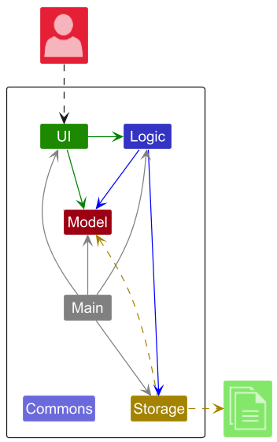
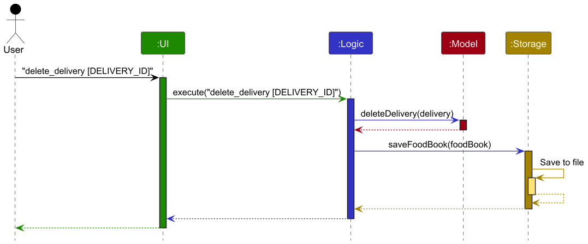
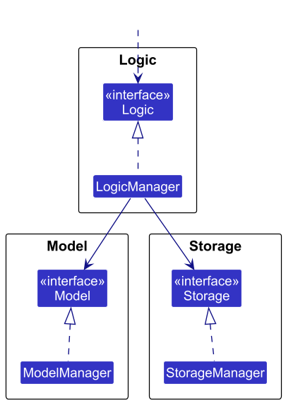
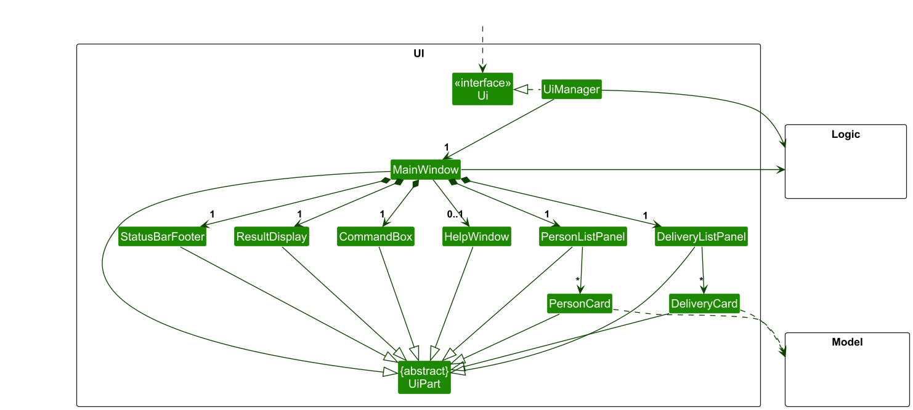
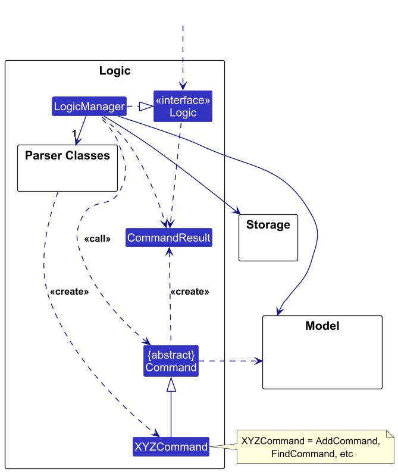
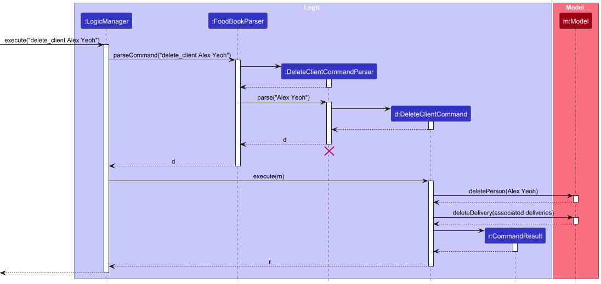
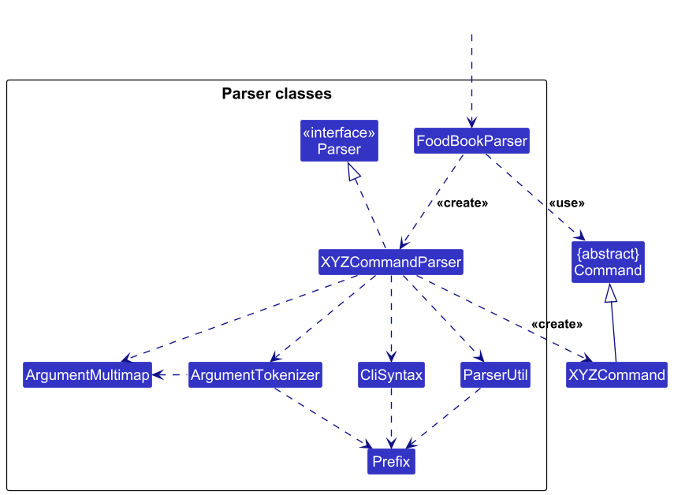
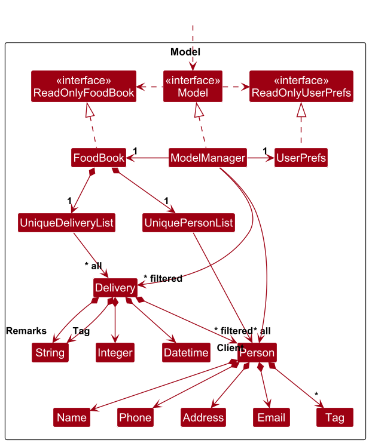
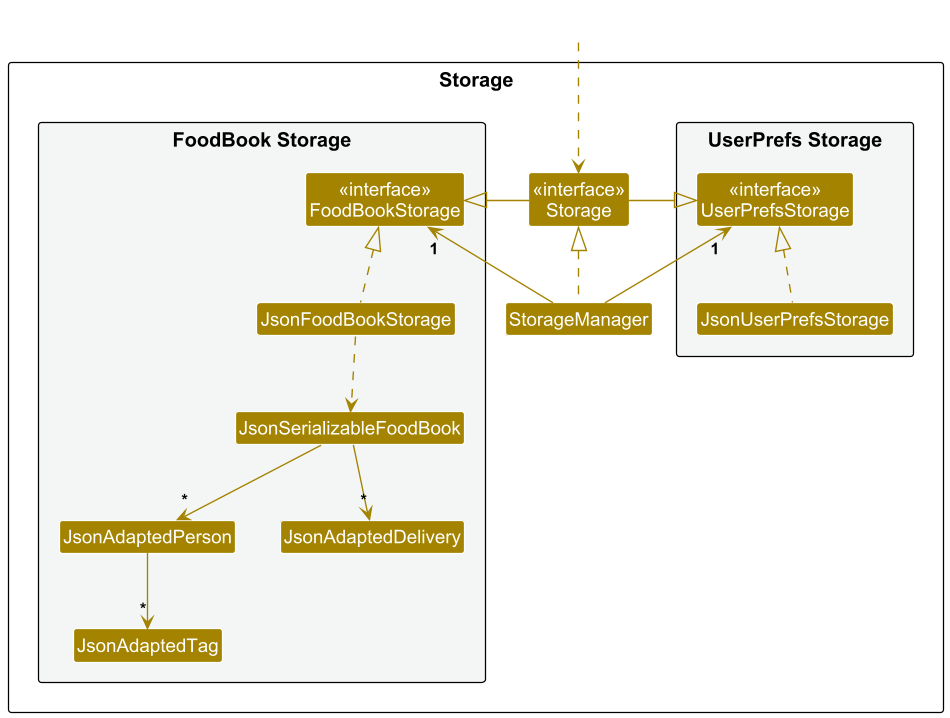
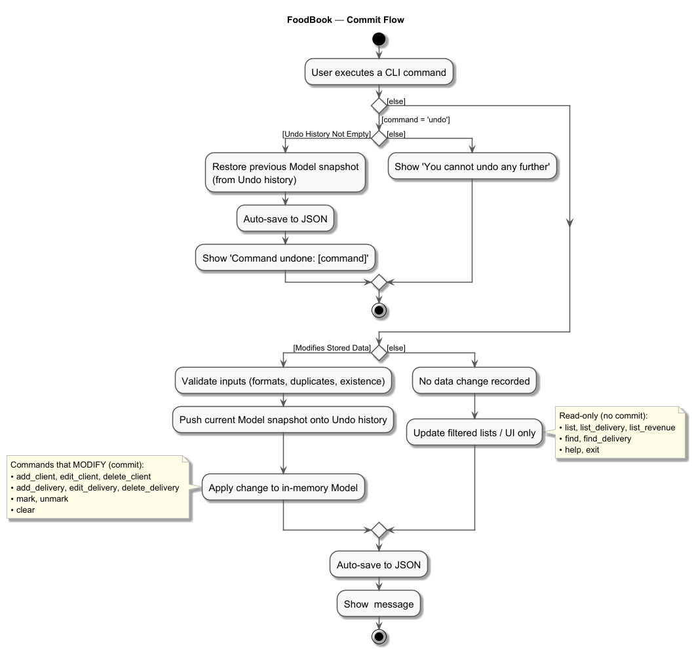

# FoodBook Developer Guide

## **Acknowledgements**

This project is based on the AddressBook-Level3 project created by the [SE-EDU initiative](https://se-education.org).

## 1. Setting up & Getting Started

Refer to the guide [here](./SettingUp.md).

## 2. Design

### Architecture

The ***Architecture Diagram*** given above explains the high-level design of the App.

Given below is a quick overview of main components and how they interact with each other.

**Main components of the architecture**

**`Main`** (consisting of classes [`Main`](https://github.com/AY2526S1-CS2103T-F14a-1/tp/blob/master/src/main/java/seedu/foodbook/Main.java) and [`MainApp`](https://github.com/AY2526S1-CS2103T-F14a-1/tp/blob/master/src/main/java/seedu/foodbook/MainApp.java)) is in charge of the app launch and shut down.
* At app launch, it initializes the other components in the correct sequence, and connects them up with each other.
* At shut down, it shuts down the other components and invokes cleanup methods where necessary.

The bulk of the app's work is done by the following four components:

* [**`UI`**](#ui-component): The UI of the App.
* [**`Logic`**](#logic-component): The command executor.
* [**`Model`**](#model-component): Holds the data of the App in memory.
* [**`Storage`**](#storage-component): Reads data from, and writes data to, the hard disk.

[**`Commons`**](#common-classes) represents a collection of classes used by multiple other components.

**How the architecture components interact with each other**

The *Sequence Diagram* below shows how the components interact with each other for the scenario where the user issues the command `delete_delivery`.

Each of the four main components (also shown in the diagram above),

* defines its *API* in an `interface` with the same name as the Component.
* implements its functionality using a concrete `{Component Name}Manager` class (which follows the corresponding API `interface` mentioned in the previous point.

For example, the `Logic` component defines its API in the `Logic.java` interface and implements its functionality using the `LogicManager.java` class which follows the `Logic` interface. Other components interact with a given component through its interface rather than the concrete class (reason: to prevent outside component's being coupled to the implementation of a component), as illustrated in the (partial) class diagram below.

The sections below give more details of each component.

### UI component

The **API** of this component is specified in [`Ui.java`](https://github.com/AY2526S1-CS2103T-F14a-1/tp/blob/master/src/main/java/seedu/foodbook/ui/Ui.java)

The UI consists of a `MainWindow` that is made up of parts e.g.`CommandBox`, `ResultDisplay`, `PersonListPanel`, `DeliveryListPanel`, `StatusBarFooter` etc. All these, including the `MainWindow`, inherit from the abstract `UiPart` class which captures the commonalities between classes that represent parts of the visible GUI.

The `UI` component uses the JavaFx UI framework. The layout of these UI parts are defined in matching `.fxml` files that are in the `src/main/resources/view` folder. For example, the layout of the [`MainWindow`](https://github.com/se-edu/addressbook-level3/tree/master/src/main/java/seedu/address/ui/MainWindow.java) is specified in [`MainWindow.fxml`](https://github.com/se-edu/addressbook-level3/tree/master/src/main/resources/view/MainWindow.fxml)

The `UI` component,

* executes user commands using the `Logic` component.
* listens for changes to `Model` data so that the UI can be updated with the modified data.
* keeps a reference to the `Logic` component, because the `UI` relies on the `Logic` to execute commands.
* depends on some classes in the `Model` component, as it displays `Person` object residing in the `Model`.

### Logic component

The **API** of this component is specified in [`Logic.java`](https://github.com/AY2526S1-CS2103T-F14a-1/tp/blob/master/src/main/java/seedu/foodbook/logic/Logic.java)

Here's a (partial) class diagram of the `Logic` component:

The sequence diagram below illustrates the interactions within the `Logic` component, taking `execute("delete_client Alex Yeoh")` API call as an example.

 **Note:** The lifeline for `DeleteCommandParser` should end at the destroy marker (X) but due to a limitation of PlantUML, the lifeline continues till the end of diagram.

How the `Logic` component works:

1. When `Logic` is called upon to execute a command, it is passed to an `FoodBookParser` object which in turn creates a parser that matches the command (e.g., `DeleteClientCommandParser`) and uses it to parse the command.
1. This results in a `Command` object (more precisely, an object of one of its subclasses e.g., `DeleteClientCommand`) which is executed by the `LogicManager`.
1. The command can communicate with the `Model` when it is executed (e.g. to delete a person and associated deliveries). 
   Note that in the code this can take several interactions (between the command object and the `Model`) to achieve.
1. The result of the command execution is encapsulated as a `CommandResult` object which is returned back from `Logic`.

Here are the other classes in `Logic` (omitted from the class diagram above) that are used for parsing a user command:

How the parsing works:
* When called upon to parse a user command, the `FoodBookParser` class creates an `XYZCommandParser` (`XYZ` is a placeholder for the specific command name e.g., `AddClientCommandParser`) which uses the other classes shown above to parse the user command and create a `XYZCommand` object (e.g., `AddClientCommand`) which the `FoodBookParser` returns back as a `Command` object.
* All `XYZCommandParser` classes (e.g., `AddClientCommandParser`, `DeleteDeliveryCommandParser`, ...) inherit from the `Parser` interface so that they can be treated similarly where possible e.g, during testing.

### Model component
The **API** of this component is specified in [`Model.java`](https://github.com/AY2526S1-CS2103T-F14a-1/tp/blob/master/src/main/java/seedu/foodbook/model/Model.java)

The `Model` component,

* stores the food book data i.e., all `Person` objects (which are contained in a `UniquePersonList` object) and `Delivery` objects (which are contained in a `UniqueDeliveryList` object).
* stores the currently 'selected' `Person` and `Delivery` objects (e.g., results of a search query) as a separate _filtered_ list which is exposed to outsiders as an unmodifiable `ObservableList<Person>` and `ObservableList<Delivery>` respectively.  These can be 'observed' e.g. the UI can be bound to these lists so that the UI automatically updates when the data in the list change.
* stores a `UserPref` object that represents the user’s preferences. This is exposed to the outside as a `ReadOnlyUserPref` objects.
* does not depend on any of the other three components (as the `Model` represents data entities of the domain, they should make sense on their own without depending on other components)

### Storage component

The **API** of this component is specified in [`Storage.java`](https://github.com/AY2526S1-CS2103T-F14a-1/tp/blob/master/src/main/java/seedu/foodbook/storage/Storage.java)

The `Storage` component,
* can save both food book data and user preference data in JSON format, and read them back into corresponding objects.
* inherits from both `FoodBookStorage` and `UserPrefStorage`, which means it can be treated as either one (if only the functionality of only one is needed).
* depends on some classes in the `Model` component (because the `Storage` component's job is to save/retrieve objects that belong to the `Model`)

### Common classes

Classes used by multiple components are in the `seedu.foodbook.commons` package.

### Full Workflow

The diagram above gives a full overview of the workflow of FoodBook.

--------------------------------------------------------------------------------------------------------------------

## **Documentation, logging, testing, configuration, dev-ops**

* [Documentation guide](./Documentation.md)
* [Testing guide](./Testing.md)
* [Logging guide](./Logging.md)
* [Configuration guide](./Configuration.md)
* [DevOps guide](./DevOps.md)

--------------------------------------------------------------------------------------------------------------------

## **Appendix: Requirements**

### Product scope

*Target user profile**:
- small food business owners in Singapore (e.g., home-based caterers, micro-F&B doing deliveries)

- manage many client addresses and recurring deliveries

- prefer fast CLI workflows over complex GUIs; type quickly; value minimal repetition

- often work solo or with 1 helper; need quick search/edit, duplicate prevention, and simple reporting

- store data locally

**Value proposition**: FoodBook provides a fast, reliable CLI to store, search, and manage clients and deliveries.
Compared to notes/spreadsheets, it reduces admin time via quick add/edit/filter, validation & duplication warnings, status tracking, and simple reporting, improving delivery accuracy and day-to-day efficiency.

### User Stories

**Legend:** High (must have) – ``***``  |  Medium (nice to have) – ``**``  |  Low (later/considered) – ``*``

| Priority | As a …              | I want to …                                                | So that I can …                                                         |
|:------:|----------------------|------------------------------------------------------------|-------------------------------------------------------------------------|
| ``***`` | food business owner  | add a client with name/phone/email/unit/postal             | keep accurate contact/address records                                   |
| ``***`` | food business owner  | edit a client’s details                                    | keep information up-to-date                                             |
| ``***`` | food business owner  | delete a client                                            | remove outdated entries                                                 |
| ``***`` | food business owner  | add a delivery (date/time/remarks/price, linked to client) | schedule jobs and avoid forgetting                                      |
| ``***`` | food business owner  | mark/unmark a delivery as completed                        | see what’s pending vs done                                              |
| ``***`` | food business owner  | edit a delivery                                            | change delivery details dynamically                                     |
| ``***`` | food business owner  | delete a delivery                                          | Remove dud deliveries                                                   |
| ``***`` | food business owner  | search clients by name/phone/email                         | find a client quickly                                                   |
| ``***`` | food business owner  | search deliveries by date, client, tag                     | track all jobs of a a particular type (e.g. deliveries on the same day) |
| ``**`` | food business owner  | undo a recent change                                       | recover from mistakes                                                   |
| ``**`` | food business owner  | tag deliveries as corporate or personal                    | prioritise important deliveries                                         |
| ``*``  | food business owner  | list revenue by various criteria                           | analyze business patterns and growth                                    |

*Items marked ``*`` are considered but not required for MVP; keep if time permits.*

### Use Cases

_(For all use cases below, the System is FoodBook and the Actor is the user unless specified otherwise.)_

----------

### UC01 – Add a client

**Goal:** Create a new client record.

**Main Success Scenario (MSS):**

1.  User provides the required client details.

2.  System validates the details and saves the client.

3.  System confirms success. **Use case ends.**

**Extensions:**

-   **1a. Any field is invalid** → System shows a specific error. → Use case resumes at Step 1.

-   **1b. Duplicate client detected** → System warns that a similar client already exists and offers options (cancel or modify details). → Use case resumes at Step 1.

----------

### UC02 – Edit a client

**Precondition:** Target client exists.  
**Goal:** Update an existing client’s details.

**MSS:**

1.  User selects the target client.

2.  System shows current client details.

3.  User provides updated details.

4.  System validates and updates the record.

5.  System confirms success. **Use case ends.**

**Extensions:**

-   **1a. No such client** → System informs “Client not found.” **Use case ends.**

-   **4a. Updated details are invalid or conflict** → System shows a specific error. → Use case resumes at Step 3.

----------

### UC03 – Add a delivery for a client

**Precondition:** Target client exists.  
**Goal:** Create a new delivery linked to a client.

**MSS:**

1.  User selects the client and provides delivery details (date/time, items/remarks, cost).

2.  System validates details and creates the delivery with a unique identifier.

3.  System confirms success and displays the delivery identifier. **Use case ends.**

**Extensions:**

-   **1a. Client does not exist** → System informs “Client not found.” **Use case ends.**

-   **1b. Invalid date/time/cost** → System shows a specific error. → Use case resumes at Step 1.

----------

### UC04 – View and mark deliveries for a day

**Goal:** Review deliveries on a date and mark completion.

**MSS:**

1.  User specifies a date to view deliveries.

2.  System lists deliveries on that date with identifiers and statuses.

3.  User selects a delivery to mark as completed.

4.  System updates the status and confirms. **Use case ends.**

**Extensions:**

-   **1a. Invalid date** → System shows “Invalid date provided.” **Use case ends.**

-   **2a. No deliveries on that date** → System shows “No deliveries found.” **Use case ends.**

-   **3a. Delivery not found (stale list/ID mismatch)** → System shows “Delivery does not exist.” **Use case ends.**

----------

### UC05 – Undo last change

**Precondition:** At least one reversible change exists.  
**Goal:** Revert the most recent change.

**MSS:**

1.  User requests to undo the most recent change.

2.  System reverts the change (e.g., status back to pending, record restored) and confirms. **Use case ends.**

**Extensions:**

-   **1a. Nothing to undo / history limit reached** → System shows “You cannot undo any further.” **Use case ends.**

----------

### UC06 – List revenue for a period

**Goal:** View revenue aggregated for a date range.

**MSS:**

1.  User specifies a start date and an end date.

2.  System calculates and displays revenue for deliveries within the period. **Use case ends.**

**Extensions:**

-   **1a. Invalid date(s) or start after end** → System shows “Invalid date provided.” **Use case ends.**

----------

### UC07 – Delete a client

**Precondition:** Target client exists.  
**Goal:** Remove a client (and related deliveries).

**MSS:**

1.  User selects the client to delete.

2.  System identifies any associated deliveries.

3.  System deletes the client and all associated deliveries.

4.  System confirms deletion and indicates number of deliveries removed. **Use case ends.**

**Extensions:**

-   **1a. Client not found** → System shows “Client not found.” **Use case ends.**

-   **1b. User cancels at confirmation** → System aborts deletion. **Use case ends.**

----------

### UC08 – Delete a delivery

**Precondition:** Target delivery exists.  
**Goal:** Remove a delivery.

**MSS:**

1.  User selects the delivery to delete.

2.  System removes the delivery.

3.  System confirms success. **Use case ends.**

**Extensions:**

-   **1a. Delivery not found** → System shows “No delivery found.” **Use case ends.**

----------

### UC09 – Edit a delivery

**Precondition:** Target delivery exists.  
**Goal:** Update delivery details.

**MSS:**

1.  User selects the delivery to edit.

2.  System shows current delivery details.

3.  User provides updated details (e.g., date/time, remarks, cost).

4.  System validates and updates the delivery.

5.  System confirms success. **Use case ends.**

**Extensions:**

-   **1a. Delivery not found** → System shows “Delivery does not exist.” **Use case ends.**

-   **4a. Invalid date/time/cost** → System shows a specific error. → Use case resumes at Step 3.

---

### Non-Functional Requirements

#### Performance
1. **Commands** should complete within **1 second** for up to **5,000 clients** and **20,000 deliveries**.
2. **Search/filter** should return results in **< 500 ms** on typical laptops.

#### Usability
1. **Clear, actionable error messages** (field-specific).

#### Reliability & Data Safety
1. **Auto-save** after every successful command.
2. **Undo** for most destructive operations.

#### Portability (Constraint-Portable)
1. Runs on **Windows/macOS/Linux** with **Java 17+**.
2. **No OS-specific paths** required.

#### Data Integrity & Validation
1. **Enforce input formats** (phone, email, unit, postal).
2. **Prevent accidental duplicates** via soft checks (same name + phone).
3. **Validate data consistency** before persisting changes to storage.

#### Security & Privacy
1. **Store data locally**; **no external network** by default.

#### Maintainability
1. Commands follow **AB3 command architecture**; **unit tests** for parsers and executors.

### Glossary

- **Client** — A customer who places orders.
- **Delivery** — A scheduled job tied to a client (date/time/remarks/price).
- **Delivery ID** — Unique identifier assigned by the system to a delivery.
- **High-priority** — Tag indicating preferred servicing order.
- **Capacity** — Daily/route limit to prevent overbooking.
- **Validation** — Input checks (format/range/consistency) performed before saving.
- **Micro-F&B food owners:** Owner-run food businesses with 1–5 staff
    (hawker stalls, home kitchens, kiosks, single cafés), doing roughly SGD 5k–50k/month, 10–150 orders/day, and 50–600
    active regulars. They use lightweight tools (POS/QR pay, spreadsheets, messaging), keep small, fast-turn inventory, and
    market locally/social-first.
  - Primary needs: cash-flow visibility, repeat-customer focus, quick turnaround, and simple,
    mobile-friendly workflows (not heavy multi-store/analytics).

## Appendix: Instructions for Manual Testing

> **Setup tips**  
> • Use `clear` to start clean.  
> • Use `undo` right after a mistake to revert recent changes.

### A. Minimal Test Flow

**A1. Prepare a clean state**
1. Launch the app.
2. Run `clear`.
3. Confirm empty lists via `list_client`, `list_delivery`.

**A2. Add 3 clients (copy-paste one per line)**
- `add_client n/May Chen p/81234567 e/mayc@example.com a/Blk 123 #05-12, 560123 t/regular`
- `add_client n/Acme Pte Ltd p/65123456 e/sales@acme.com a/10 Science Park Dr t/corporate`
- `add_client n/John Doe p/60000001 e/john@demo.sg a/1 Clementi Ave 3, 129907`

*Expected:* 3 client cards appear.

**A3. Quick edit (spot check)**
- `edit_client May Chen p/95551234 e/mayc@example.com a/11 Holland Dr #02-15, 270011 t/weekly`

*Expected:* May’s fields update.

**A4. Add deliveries**
- `add_delivery n/May Chen d/3/11/2025 tm/1430 c/28.50 r/2x laksa, leave at reception t/Personal`
- `add_delivery n/Acme Pte Ltd d/3/11/2025 tm/1800 c/420.00 r/Company buffet t/Corporate`
- `add_delivery n/John Doe d/4/11/2025 tm/0900 c/15.00 r/Breakfast set`

*Expected:* Each returns a **Delivery ID**; cards show delivery status with an empty checkbox.

**A5. List & note IDs**
- `list_delivery`

*Expected:* All deliveries with unique IDs.

**A6. Edit one delivery (replace X with an actual ID)**
- `edit_delivery X d/11/11/2025 tm/1830 r/Customer requested later pickup`

*Expected:* Delivery X updated.

**A7. Filter then reset**
- `find_delivery d/3/11/2025`
- `list_delivery`

*Expected:* Filter shows only that date; `list_delivery` resets view.

### B. Mark / Unmark

**B1. Toggle status (replace X)**
- `mark X`
- `unmark X`

*Expected:* Card checks/unchecks delivery status box.

### C. Revenue

**C1. Baseline**
- `list_revenue`

*Expected:* Totals the cost of all deliveries.

**C2. Date ranges (inclusive)**
- `list_revenue sd/3/11/2025 ed/3/11/2025`
- `list_revenue sd/3/11/2025 ed/12/11/2025`

*Expected:* Lists revenue of only 1 day; Lists total of all delivery within time period

**C4. Client / tag / status filters**
- `list_revenue n/Acme Pte Ltd`
- `list_revenue t/Corporate`
- `list_revenue s/not_delivered`

*Expected:* Lists revenue of delivery named Acme Pte Ltd; Lists revenue of deliveries tagged with corporate;
Lists revenue of all uncompleted deliveries. 

### D. Undo

Try one destructive change then `undo`:
1. `edit_delivery X c/999.99`
2. `undo`

*Expected:* Previous state restored (within the undo limit).
