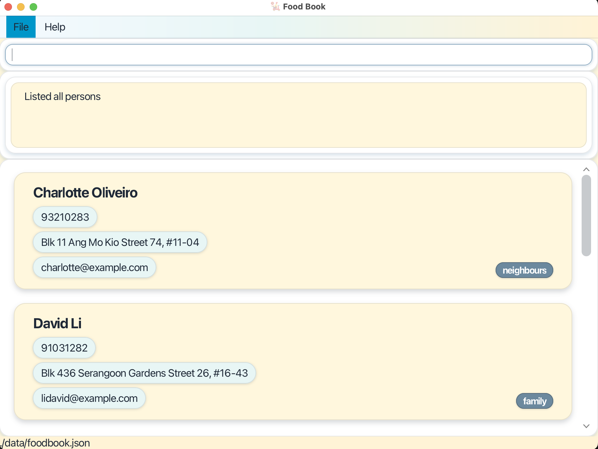
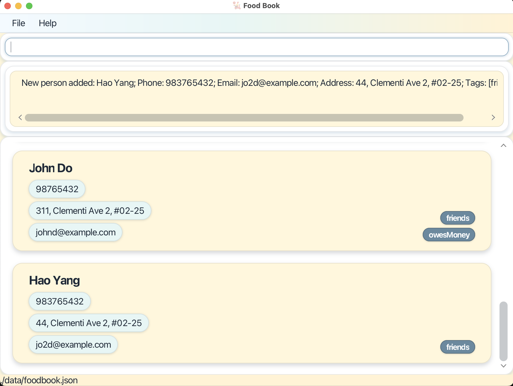
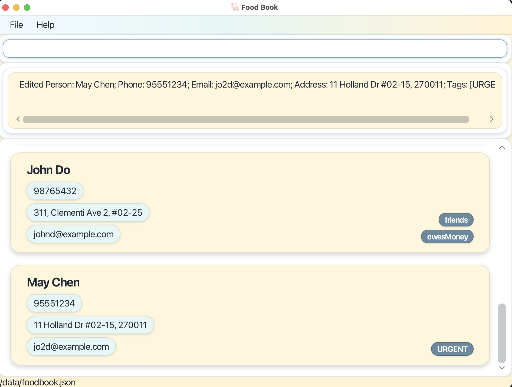

# FoodBook — User Guide

FoodBook is a **desktop app for small food businesses to manage clients and deliveries**. While it has a GUI, most interactions use a fast **Command Line Interface (CLI)** so you can work quickly during busy hours.

---

## Table of Contents

- [Quick Start](#quick-start)
- [Features](#features)
  - [Viewing help : `help`](#viewing-help--help)
  - [Clients](#clients)
    - [Listing all clients : `list_client`](#listing-all-clients--list_client)
    - [Adding a client : `add_client`](#adding-a-client--add_client)
    - [Editing a client : `edit_client`](#editing-a-client--edit_client)
    - [Locating clients : `find_client`](#locating-clients--find_client)
    - [Deleting a client : `delete_client`](#deleting-a-client--delete_client)
  - [Deliveries](#deliveries)
    - [Listing all deliveries : `list_delivery`](#listing-all-deliveries--list_delivery)
    - [Adding a delivery : `add_delivery`](#adding-a-delivery--add_delivery)
    - [Editing a delivery : `edit_delivery`](#editing-a-delivery--edit_delivery)
    - [Marking / Unmarking : `mark` / `unmark`](#marking--unmarking--mark--unmark)
    - [Locating deliveries : `find_delivery`](#locating-deliveries--find_delivery)
  - [Revenue : `list_revenue`](#revenue--list_revenue)
  - [Undo : `undo`](#undo--undo)
  - [Clearing all entries : `clear`](#clearing-all-entries--clear)
  - [Exiting the program : `exit`](#exiting-the-program--exit)
- [Saving the data](#saving-the-data)
- [Editing the data file](#editing-the-data-file)
- [FAQ](#faq)
- [Known issues](#known-issues)
- [Command Summary](#command-summary)

---

## Quick Start

1. **Install Java 17 or newer.**
2. Place `foodbook.jar` in your preferred folder.
3. Run the app:
   ```bash
   java -jar foodbook.jar
   ```
   FoodBook launches with sample data.
4. Try:
   - `help` — quick reference
   - `list_client` — list all clients
   - `list_delivery` — list all deliveries

**Tip:** FoodBook auto-saves after every successful command.

---

## Features

### Viewing help : `help`

Shows the help window with a quick reference.

**Format:** `help`
- Example:


---

## Clients

### Listing all clients : `list_client`

Shows all clients.

**Format:** `list_client`
- Example:


---

### Adding a client : `add_client`

Create a client with contact and address details.

**Format:**
```
add_client n/NAME p/PHONE e/EMAIL a/ADDRESS [t/TAG]
```

**Examples:**
```
add_client n/May Chen p/81234567 e/mayc@example.com a/Blk 123 #05-12, 560123 t/regular
add_client n/Acme Catering p/65123456 e/sales@acme.com a/10 Science Park Dr t/corporate
```


**Notes:**
- Phone should be more than 3 digits long.
- Tags are optional and help with search/organization.

---

### Editing a client : `edit_client`

Update fields for an existing client by **current name**. Linked deliveries will reflect changes.

**Format:**
```
edit_client CURRENT_NAME [n/NEW_NAME] [p/PHONE] [e/EMAIL] [a/ADDRESS] [t/TAG]
```

**Example:**
```
edit_client Hao Yang n/May Chen p/95551234 a/11 Holland Dr #02-15, 270011 t/URGENT
```


**Notes:**
- The `n/CURRENT_NAME` must match exactly.
- Provide at least one field to change.

---

### Locating clients : `find_client`

Search by name keywords, phone, and/or email. Any provided field is matched.

**Format:**
```
find_client [n/NAME_KEYWORDS] [p/PHONE] [e/EMAIL]
```

**Examples:**
```
find_client n/May
find_client p/81234567
find_client e/@acme.com
```

---

### Deleting a client : `delete_client`

Delete a client by name. All associated deliveries are removed (cascading).

**Format:**
```
delete_client n/NAME
```

**Example:**
```
delete_client n/Acme Pte Ltd
```

---

## Deliveries

### Listing all deliveries : `list_delivery`

Shows all deliveries.

**Format:** `list_delivery`

---

### Adding a delivery : `add_delivery`

Create a delivery linked to an existing client. Each delivery gets a unique ID.

**Format:**
```
add_delivery n/CLIENT_NAME d/DATE tm/TIME c/COST [r/REMARKS] [t/TAG]
```
- **Date:** `d/M/yyyy` (e.g., `4/11/2025`)
- **Time:** `HHmm` 24-hour (e.g., `1430`)

**Examples:**
```
add_delivery n/May Chen d/4/11/2025 tm/1430 c/28.50 r/2x laksa, leave at reception t/Personal
add_delivery n/Acme Pte Ltd d/4/11/2025 tm/1800 c/420.00 r/Company buffet t/Corporate
```

---

### Editing a delivery : `edit_delivery`

Modify fields of an existing delivery **by client name**.

**Format:**
```
edit_delivery CLIENT_NAME [n/NEW_NAME] [d/DATE tm/HHmm] [r/REMARKS] [c/COST]
```

**Examples:**
```
edit_delivery May Chen tm/1515 r/Customer requested later pickup
edit_delivery Acme Pte Ltd d/4/11/2025 tm/1830 c/450.00
```

**Note:** Provide both `d/` and `tm/` when changing schedule.

---

### Marking / Unmarking : `mark` / `unmark`

Toggle delivery completion status by Delivery **ID**.

**Formats:**
```
mark ID
unmark ID
```

**Result:** Card shows `Delivered: True` (or `False`).

---

### Locating deliveries : `find_delivery`

Filter deliveries by any combination of client/date/tag. **At least one** of `n/`, `d/`, or `t/` must be provided; if none are given, the command fails.

**Format:**
```
find_delivery [n/CLIENT_NAME] [d/DATE] [t/TAG]
```

**Examples:**
```
find_delivery d/4/11/2025
find_delivery n/Acme Pte Ltd d/4/11/2025
find_delivery t/Corporate
```

---

## Revenue : `list_revenue`

Display revenue based on recorded deliveries.

**Format:**
```
list_revenue [sd/DATE] [ed/DATE] [n/CLIENT_NAME] [t/tag] [s/delivered|not_delivered]
```
- If only `sd/DATE` is provided, it shows that single day.
- Use `s/delivered` or `s/not_delivered` to filter by completion.

**Examples:**
```
list_revenue
list_revenue sd/1/10/2025 ed/31/10/2025
list_revenue n/Acme Pte Ltd sd/1/10/2025 ed/31/10/2025
list_revenue sd/28/10/2025 s/delivered
```

---

## Undo : `undo`

Restore the previous state of clients and deliveries (e.g., after an accidental edit or delete).

**Format:** `undo`

**Note:** Redo is not available.

---

## Clearing all entries : `clear`

Remove all data from FoodBook.

**Format:** `clear`

**Caution:** Irreversible; consider backups.

---

## Exiting the program : `exit`

Quit the app.

**Format:** `exit`

---

## Saving the data

FoodBook auto-saves to disk after every successful command.

---

## Editing the data file

Data are stored as JSON at:
```
[JAR location]/data/foodbook.json
```

**Caution:** If you corrupt the JSON, FoodBook may start with an empty file on next launch. Keep backups.

---

## FAQ

**Keyboard-only usage?** Yes. The app is designed for fast CLI input; the GUI updates alongside.

**Tag colours?** `Personal` and `Corporate` have special colours; other tags use a default style.

**Invalid dates/times?** Commands are rejected with the expected format: `d/M/yyyy`, `HHmm`.

**Undo deletes?** Use `undo` to revert the last change. 

---

## Known issues

- **Multi-monitor:** If the app reopens off-screen, delete `preferences.json` and relaunch.
- **Help window:** If minimized, running `help` again won’t open a new one—restore the minimized window.

---

## Command Summary

| Action | Format |
|--------|--------|
| **List Clients** | `list_client` |
| **Add Client** | `add_client n/NAME p/PHONE e/EMAIL a/ADDRESS [t/TAG]` |
| **Edit Client** | `edit_client n/CURRENT_NAME [n/NEW_NAME] [p/PHONE] [e/EMAIL] [a/ADDRESS] [t/TAG]` |
| **Delete Client** | `delete_client n/NAME` |
| **Find Client** | `find_client [n/NAME_KEYWORDS] [p/PHONE] [e/EMAIL]` |
| **List Deliveries** | `list_delivery` |
| **Add Delivery** | `add_delivery n/CLIENT_NAME d/DATE tm/TIME c/COST [r/REMARKS] [t/TAG]` |
| **Edit Delivery** | `edit_delivery CLIENT_NAME [n/NEW_NAME] [d/DATE tm/HHmm] [r/REMARKS] [c/COST]` |
| **Delete Delivery** | `delete_delivery ID` |
| **Mark / Unmark** | `mark ID` / `unmark ID` |
| **Find Delivery** | `find_delivery [n/CLIENT_NAME] [d/DATE] [t/TAG]` |
| **List Revenue** | `list_revenue [sd/DATE] [ed/DATE] [n/CLIENT_NAME] [t/tag] [s/delivered\|not_delivered]` |
| **Undo** | `undo` |
| **Help** | `help` |
| **Clear** | `clear` |
| **Exit** | `exit` |

